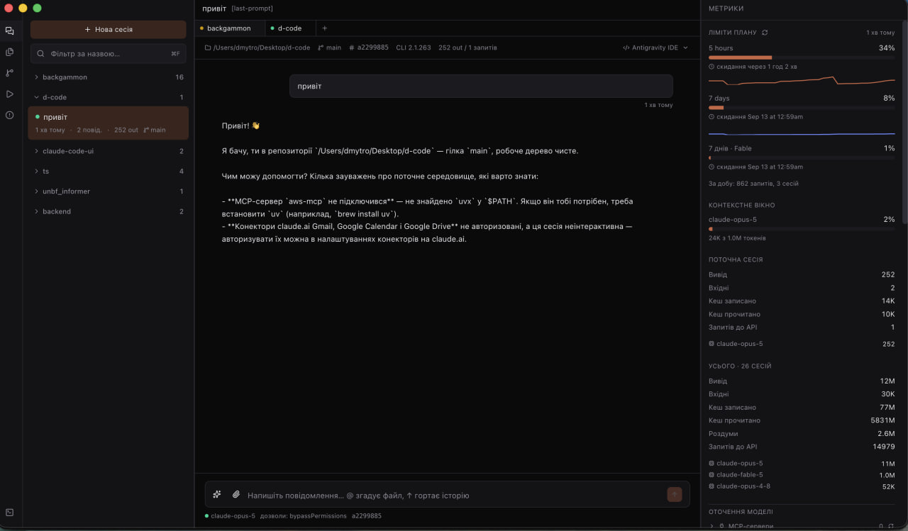
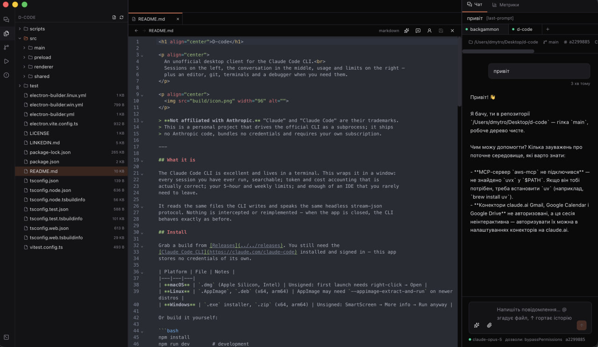

<h1 align="center">D-code</h1>

<p align="center">
  An unofficial desktop client for the Claude Code CLI.<br>
  Sessions on the left, the conversation in the middle, usage and limits on the right —
  plus an editor, git, terminals and a debugger when you need them.
</p>

<p align="center">
  
</p>

> **Not affiliated with Anthropic.** "Claude" and "Claude Code" are their trademarks.
> This is a personal project that drives the official CLI as a subprocess; it ships
> no Anthropic code, bundles no credentials and requires your own subscription.

---

## What it is

The Claude Code CLI is excellent and lives in a terminal. This wraps it in a window:
every session you have ever run, searchable; token and cost accounting that is
actually correct; your 5-hour and weekly limits; and enough of an IDE that you rarely
need to leave.

It reads the same files the CLI writes and speaks the same headless stream-json
protocol. Nothing is intercepted or reimplemented — when the app is closed, the CLI
behaves exactly as before.

## Screenshots

<p align="center">
  
  <br><em>Sessions on the left, the conversation in the middle, limits and token accounting on the right.</em>
</p>

<p align="center">
  
  <br><em>The editor with the file tree and the chat kept alongside it.</em>
</p>

## Install

Grab a build from [Releases](../../releases). You still need the
[Claude Code CLI](https://claude.com/claude-code) installed and signed in — this app
stores no credentials of its own.

| Platform | File | Notes |
|---|---|---|
| **macOS** | `.dmg` (Apple Silicon, Intel) | Unsigned: first launch needs right-click → Open |
| **Linux** | `.AppImage`, `.deb` (x64, arm64) | AppImage may need `--appimage-extract-and-run` on newer distros |
| **Windows** | `.exe` installer, `.zip` (x64, arm64) | Unsigned: SmartScreen → More info → Run anyway |

Or build it yourself:

```bash
npm install
npm run dev        # development
npm run dist       # package for the current platform
```

## Feature support

Everything works on every platform unless noted. The gaps are honest ones — each has
a reason, listed below the table.

| | macOS | Linux | Windows |
|---|:---:|:---:|:---:|
| Live chat, streaming, interrupt | ✅ | ✅ | ✅ |
| Session history, search, forking | ✅ | ✅ | ✅ |
| Token and cost accounting | ✅ | ✅ | ✅ |
| Editor, LSP, rename, debugger | ✅ | ✅ | ✅ |
| Git, diffs, conflicts, pull requests | ✅ | ✅ | ✅ |
| Images, attachments, checkpoints | ✅ | ✅ | ✅ |
| Tasks (`npm run` with live output) | ✅ | ✅ | ✅ |
| **Embedded terminal** | ✅ | ✅ | ✅ |
| **Open in external terminal** | Terminal.app | 7 emulators¹ | Windows Terminal / cmd |
| **Open in IDE** | `/Applications` | `.desktop` files | Program Files |
| **Limits history graph** | ✅ | ➖² | ✅³ |
| **Desktop notifications** | ✅ | ✅ | ✅ |
| Phone access, pairing, QR | ✅ | ✅ | ✅ |
| **Tunnel: Cloudflare / own command** | ✅ | ✅ | ✅ |
| **Tunnel: Pinggy over ssh** | ✅ | ✅ | ➖⁴ |

¹ `x-terminal-emulator`, `gnome-terminal`, `konsole`, `xfce4-terminal`, `alacritty`,
`kitty`, `xterm` — the first one found wins.

² The graph reads `plan-usage-history.json`, written by the Claude desktop app, which
does not exist on Linux. Current percentages are unaffected — they come from polling
the CLI directly.

³ Only if the Claude desktop app is installed and has run recently.

⁴ Pinggy's anonymous tunnels want an empty ssh password, which is supplied with
`SSH_ASKPASS=/usr/bin/true` — a path Windows does not have. Untested there, and
expected to fail; the Cloudflare provider and a custom command both work.

> **A note on prebuilt packages.** The Linux and Windows builds in `release/` that
> were cross-built from macOS ship **without** the embedded terminal: `node-pty` is a
> native module and has to be compiled on the platform it runs on. The Terminal tab
> says so plainly. Builds from CI (see `.github/workflows/release.yml`) run on each
> native OS and have no such gap.

## Features

| | |
|---|---|
| **Sessions** | Every project the CLI has touched, grouped, searchable, with live-process indicators |
| **Full-text search** (`⌘F`) | Across all transcripts, optionally inside tool arguments and results |
| **Chat tabs** | Each tab is its own CLI process, so one can think while you type in another |
| **Interrupt** | Stops the turn and **returns your text to the composer** for editing |
| **Images and files** | Paste, drag or attach; images go as base64, files by path |
| **Editor** | CodeMirror with 20+ languages, split view, breadcrumbs, blame gutter |
| **Language server** | Completion, hover, go-to-definition (`F12`), project-wide rename (`F2`) |
| **Debugger** | Breakpoints, call stack, variables, expression evaluation |
| **Git** | Stage, commit, push/pull, stashes, branch diffs, conflict resolution |
| **Worktrees** | Create, check out and remove them; start a session in one, so several agents work on different branches without touching each other's files |
| **Pull requests** | List, create and follow check status through `gh` |
| **Checkpoints** | Roll files back to their state before any message — the CLI snapshots them |
| **Activity** | Tokens per day, top tools with error counts, per-project breakdown, cache coverage |
| **Live model switching** | Model and permission mode change in a running conversation |
| **Environment editing** | Add and remove MCP servers and hooks, each change naming the settings file it lands in |
| **Export** | Markdown or a self-contained HTML page, with secrets, e-mail addresses and home paths stripped by default |
| **Phone access** | Drive a running session from a phone: read the conversation as it streams, send, interrupt, answer permission prompts. On the local network, across a tailnet, or from anywhere through a tunnel — scanning the QR pairs the device outright |
| **Two languages** | English and Ukrainian, switchable in settings |

## Architecture

```
src/main/claude/     CLI subprocess, stream-json protocol, conversation manager
src/main/store/      path encoding, transcript parser, session scanner
src/main/metrics/    plan limits
src/main/system/     workspaces, editors, git, terminals, platform differences
src/main/lsp/        JSON-RPC client and language server manager
src/main/debug/      Node debugging over CDP
src/main/remote/     phone server, pairing, tunnels, QR encoder
src/renderer/        React interface
src/shared/          domain types and the IPC contract
```

Everything platform-specific lives in `src/main/system/platform.ts` — the rest of the
code does not know which OS it is on.

## What the CLI format actually looks like

The transcript format in CLI 2.1.x differs from most public write-ups. These are the
findings that make the difference between a correct client and a plausible-looking one:

1. **There is no `summary` line type.** Session titles come from, in order:
   `agent-name` → `ai-title` → `last-prompt` → the first user message.
2. **Tokens must be deduplicated by `requestId`.** One API reply is written as several
   lines with identical `usage`. Without dedup, output tokens inflate **2.6–3.1×** on
   real transcripts. The `usage.iterations[]` field is a breakdown of the same usage,
   not extra calls.
3. **Subagents are not in the main file.** They live in
   `<session-id>/subagents/agent-<id>.jsonl` and their tokens are not counted in the
   parent transcript. Their `sessionId` is identical to the parent's — only the file
   tells them apart.
4. **Project directory names are irreversible.** Every character outside `[a-zA-Z0-9]`
   becomes `-`, so `foo.bar`, `foo_bar` and `foo bar` collapse into one directory. The
   real path comes from the `cwd` field inside the transcript.
5. **Slash commands arrive as `user` lines without `isMeta`.** Content is the only way
   to tell them from a human message (`<command-name>`, `<local-command-stdout>`).
6. **`costUSD` is absent from transcripts.** For live sessions the CLI reports cost
   itself in `result.total_cost_usd` and `result.modelUsage[].costUSD`.
7. **`system/init` only arrives after the first message.** Waiting for it before
   allowing input is a deadlock.
8. **`statusLine` is never invoked in headless mode**, so limit percentages cannot
   come from there.
9. **`--remote-control` only works interactively.** In headless the flag is accepted
   and does nothing.
10. **Interrupt with a control request, not a signal:**
    `{"type":"control_request","request":{"subtype":"interrupt"}}` on stdin. SIGINT
    would end the process. An interrupted turn returns as a `result` with
    `is_error: true` — that is normal, not a failure.
11. **Images go in as `{"type":"image","source":{"type":"base64",…}}`** plus an
    `[Image #N]` marker in the text — exactly the shape the CLI writes into transcripts.
12. **Model and permission mode change live** via `set_model` and
    `set_permission_mode` control requests. After a mode change the CLI sends a fresh
    `system/init` **without a `model` field** — it must not overwrite the stored model.
13. **`/usage` works headless and costs nothing.** It is the most accurate limits
    source. The output is prose (`Current session: 56% used · resets Aug 23 at 3:19pm`),
    so the parser has to be forgiving.
14. **`fs.watch` does not work on `plan-usage-history.json`**: it is replaced
    atomically via rename, after which the watcher holds a dead inode. `watchFile`
    survives that.
15. **`trackingPath` in file history can be relative** — `realParentDir` from the same
    record is the base. `backupFileName: null` means the session created the file.
16. **The set of service line types grows with versions.** September 2026 added
    `pr-link`, linking a session to a pull request. It is written *every time* the
    session returns to that PR: 915 lines for 83 distinct PRs in one real session, so
    deduplication by `prNumber` is not optional.

## Language server and debugger

Completion, hover, go-to-definition and rename run through
`typescript-language-server`. Two traps cost real time:

- **A TypeScript 7 project has no `tsserver.js`.** The native compiler has no server
  mode at all, so a private copy of TypeScript 5 is kept alongside and pointed at.
- **The `--tsserver-path` flag is gone.** The path goes in `initializationOptions` as
  `{ tsserver: { path } }`.

Debugging deliberately does **not** use DAP: Node speaks the Chrome DevTools Protocol
natively, so `--inspect-brk` plus a WebSocket is enough. Four things had to be handled:

- **The first pause is an artefact.** `--inspect-brk` stops on line one before anything
  runs; skipping it is what makes user breakpoints work.
- **Stack frames carry no path**, only a `scriptId` — resolved through
  `Debugger.scriptParsed`.
- **The engine knows files by resolved paths.** A `/var/…` directory is `/private/var/…`
  to it, and a breakpoint set in a tab would silently never fire.
- **The script never exits while a debugger is attached** ("Waiting for the debugger to
  disconnect…"). The socket closes on `Runtime.executionContextDestroyed`.

## Terminals

Terminals use `node-pty`, a native module that must be built against Electron's ABI:

```bash
npx electron-rebuild -f -w node-pty
```

Without it the app does not crash — the Terminal tab simply reports the module as
unavailable and shows this command. Tasks (`npm run`) need no pty and always work.

## Phone access

Settings → **Phone access** starts a small HTTP server so a session running on
the computer can be driven from a phone on the same Wi-Fi: the conversation as it
streams, sending messages, interrupting a turn, and answering permission prompts —
which matters most, because a session left alone stalls the moment a tool needs a
decision.

The phone talks to the same conversation tabs as the desktop window, not a
parallel set of its own. Two processes appending to one transcript would corrupt
it, and a session you could no longer follow from the desktop after touching it
on the phone would be worse than no remote access at all.

**What this opens, stated plainly.** The server can make Claude Code run commands
on your machine. It is therefore:

- **off by default** and started only from the settings panel;
- reachable only with a token the browser receives after entering a **six-digit
  pairing code** shown in the app, valid ten minutes, with five wrong guesses per
  address triggering a lockout and burning the code;
- bound to the local network, with **no TLS**;
- closed when the app quits.

### From outside the local network

Two ways, and the first is the better one.

**Tailscale (recommended).** Install it on the computer and the phone and sign
both into the same account. Nothing else to configure: the server already listens
on every interface, so the tailnet address appears in the panel by itself, marked
with a globe and offered ahead of the local one.

Detection is a single range check — Tailscale hands every node an address out of
`100.64.0.0/10`, the carrier-grade NAT block from RFC 6598, which nothing else a
laptop holds is likely to use. No process to shell out to, nothing to parse, and
it works however Tailscale was installed.

This is the better option because it is not a tunnel at all: the machine stays
off the open internet, the link is WireGuard end to end, and there is no public
URL for anyone to find. When a tailnet address is present the panel says the
Cloudflare switch is unnecessary, and the warning underneath softens to match
what is actually exposed.

**A tunnel, when the phone should need nothing at all.** The **Reachable from
anywhere** switch starts a relay and shows the public `https://…` address it
hands back. On the phone side this needs only a browser, which is the point.

A tunnel rather than a forwarded port, for three reasons: it is an outbound
connection, so no router configuration is needed and carrier-grade NAT is not an
obstacle; the address is unguessable and disappears when you switch it off; and
TLS is terminated for you, which port forwarding would not be. The cost is that
traffic passes through somebody's relay — so the relay is named in the panel and
chosen explicitly, never picked for you.

| Provider | Needs installing | Notes |
|---|---|---|
| **Cloudflare** (default) | `cloudflared` | The most reliable, when it is reachable at all |
| **Pinggy** | nothing — plain `ssh` | Rides port 443, which almost nothing blocks. Free tunnels last 60 minutes and the address changes each time |
| **Own command** | whatever you name | Any command printing an `https://` address; write `{port}` where the local port belongs |

More than one provider exists because any single service is a single point of
failure. `trycloudflare.com` in particular is heavily abused for phishing and a
number of ISPs filter it outright — the symptom is `cloudflared` failing on its
very first HTTPS call to `api.trycloudflare.com` while the rest of the internet
works fine. An app that hard-coded it would simply stop working for those users
with no way out; Pinggy over `ssh` on port 443 gets through where it does not.

When a tunnel fails the panel shows the provider's own last error lines rather
than an exit code, because "code 1" tells nobody what to do.

One implementation note, since it is not obvious: `ssh` reads a password from a
terminal, never from stdin, so a subprocess with piped stdio can never answer
the prompt. `SSH_ASKPASS=/usr/bin/true` with `SSH_ASKPASS_REQUIRE=force` supplies
the empty password Pinggy's anonymous tunnels expect, without allocating a pty.

### Scanning in

The panel shows a QR code for each address it can offer, ordered by reach: the
tunnel when one is up, then the tailnet, then the local network. The code carries
the address *and* the pairing code, so scanning it opens the session already
signed in. Opening the plain link instead still asks for the code by hand.

A scan is not a second door: it runs through the same expiry, the same
per-address lockout and the same global budget as typing. On success the browser
is redirected to `/` without the query, so the pairing code does not linger in
the address bar, in history, or in a screenshot shared later.

The QR encoder is written out in `src/main/remote/qr.ts` rather than taken as a
dependency — it is a pure function of one short string. Its output is checked
module-for-module against a reference implementation in the tests, because a QR
code that almost works is a QR code nobody can scan.

Install `cloudflared` first (`brew install cloudflared`, or your distribution's
package). The app detects it and explains itself if it is missing.

**Pairing gets stronger when the tunnel comes up.** Six digits is fine on a home
network, where an attacker has to already be on it; a public URL is a different
problem. Turning the tunnel on reissues the code as ten characters from a
32-symbol alphabet — around 50 bits — and the cookie is marked `Secure` once the
request arrives over HTTPS. Two limits bound guessing, and they are deliberately
separate: five wrong codes from one address earns a one-minute lockout and burns
the code, while twenty wrong codes *in total* shut pairing down completely until
you issue a new one in the app. The per-address lockout does not count toward the
global budget, or a single address could lock you out of your own machine.

Do not forward the port through a router — use the tunnel instead. Whichever way
you reach it, treat the pairing code as the only thing between a stranger and a
shell on your machine, and turn the tunnel off when you are done.

The CLI's own `--remote-control` is a different thing and still available from the
session menu: it links an *interactive* terminal session to your Claude account.
It cannot be turned on for the headless process this app drives (see finding 9
above), which is why phone access is implemented here rather than delegated to it.

## License

MIT — see [LICENSE](LICENSE).
